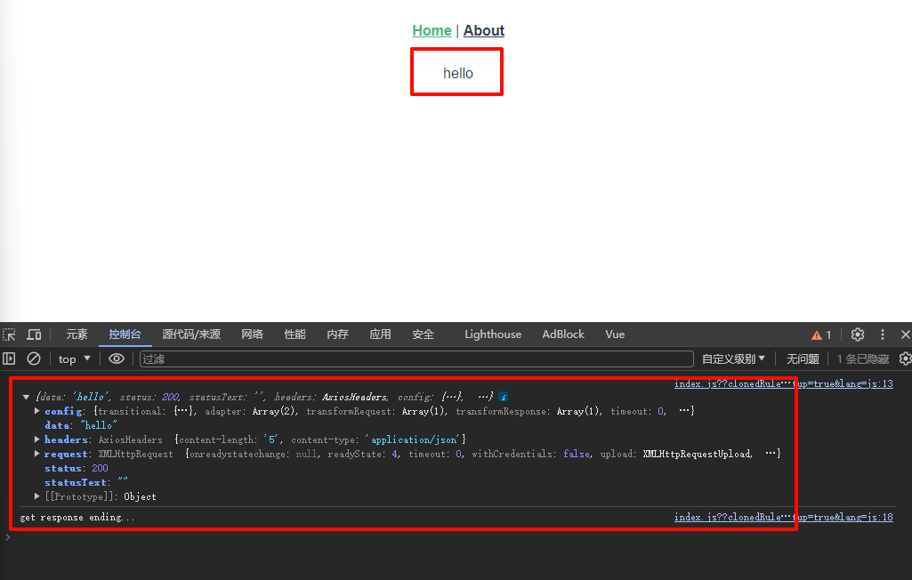

# 1. 简单示例


<details open><summary>Vue3 组件请求数据</summary>

```html
<script setup>
import {ref} from "vue";

let val = ref();
const axios = require('axios');
axios.get('http://localhost:8081/hello')
    .then((response) => {
      console.log(response);
      val.value = response.data;
    })
    .catch((error) => {
      console.log(error)
    })
    .finally(() => {
      console.log('get response ending...')
    })
</script>

<template>
<div>
{{ val }}
</div>
</template>

<!-- Add "scoped" attribute to limit CSS to this component only -->
<style scoped lang="less">

</style>
```

</details>

<details open><summary>Sprint Boot 实现的请求接口</summary>

```java
@RestController
public class Message {
    @GetMapping("/hello")
    @CrossOrigin("http://localhost:8080")
    public String sentHello() {
        return "hello";
    }
}
```

</details>

  
