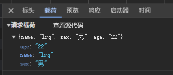
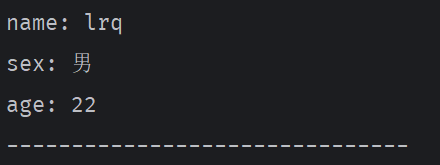

# 2. 简单示例 Post 请求

<details open><summary>前端代码</summary>

```html
<script setup>
import {ref} from "vue";

let val = ref();
const axios = require('axios');
axios.get('http://localhost:8081/hello')
    .then((response) => {
      console.log(response);
      val.value = response.data;
    })
    .catch((error) => {
      console.log(error)
    })
    .finally(() => {
      console.log('get response ending...')
    })

let f = () => {
  axios.post('http://localhost:8081/new', {
    name: 'lrq',
    sex: '男',
    age: '22'
  })
      .then((response) => {
        console.log(response);
      })
      .catch((error) => {
        console.log(error);
      })
      .finally(() => {
        console.log('post response ending...')
      })
};
</script>

<template>
<div @click="f">
{{ val }}
</div>
</template>

<!-- Add "scoped" attribute to limit CSS to this component only -->
<style scoped lang="less">

</style>
```

  


</details>

<details open><summary>后端代码</summary>

```js
@RestController
public class Message {
    @GetMapping("/hello")
    @CrossOrigin("http://localhost:8080")
    public String sentHello() {
        return "hello";
    }

    @PostMapping("/new")
    @CrossOrigin("http://localhost:8080")
    public void printMsg(@RequestBody Map<String, Object> map) {
        System.out.println("name: " + map.get("name"));
        System.out.println("sex: " + map.get("sex"));
        System.out.println("age: " + map.get("age"));
        System.out.println("-------------------------------");
    }
}
```

</details>

  
