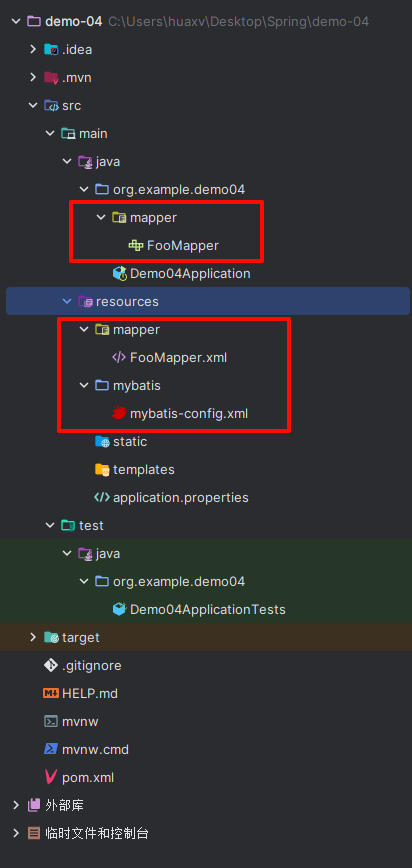
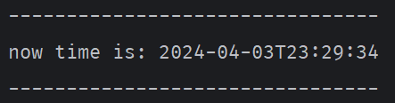

# 1. 连接 mysql

## 目录结构

  

## 安装依赖

1. `Spring Web`
2. `JDBC API`
3. `Spring Data JDBC`
4. `MyBatis Framework`
5. `MySQL Driver`
6. `Lombok`

## 定义 Mapper 接口

位置：`org.example.demo04.mapper`

类名：`FooMapper.java`

```java
package org.example.demo04.mapper;

import org.apache.ibatis.annotations.Mapper;

import java.time.LocalDateTime;

@Mapper // 自动按照接口生成一个实例 Bean，可以装箱后直接使用 $.now()
public interface FooMapper {
    /**
     * 获取数据库的当前时间
     * @return
     */
    LocalDateTime now();
}
```

## 创建 mapper 映射文件

位置：`src/main/resources/mapper`

文件名：`FooMapper.xml`

在这个 mapper 目录下专门创建用于存放 mapper 映射的文件

`FooMapper.xml` 与 `FooMapper.java` 相互映射。

```xml
<?xml version="1.0" encoding="UTF-8" ?>
<!DOCTYPE mapper PUBLIC "-//mybatis.org//DTD Mapper 3.0//EN"
        "http://mybatis.org/dtd/mybatis-3-mapper.dtd">

<!-- 映射到的 FooMapper.java 文件路径 -->
<mapper namespace="org.example.demo04.mapper.FooMapper">

    <!-- 映射到 FooMapper.java 接口中的 now 方法，该方法的返回值类型是 LocalDateTime -->
    <select id="now" resultType="java.time.LocalDateTime">
        SELECT NOW();
    </select>
</mapper>
```

## 创建 MyBatis 配置文件

位置：`src/main/resources/mybatis/mybatis-config.xml`

文件名：`mybatis-config.xml`

```xml
<?xml version="1.0" encoding="UTF-8" ?>
<!DOCTYPE configuration PUBLIC "-//mybatis.org//DTD Config 3.0//EN"
        "http://mybatis.org/dtd/mybatis-3-config.dtd">
<configuration>

</configuration>
```

## 配置 `application.properties`

```properties
spring.application.name=demo-04
spring.datasource.type=com.zaxxer.hikari.HikariDataSource
spring.datasource.driver-class-name=com.mysql.cj.jdbc.Driver
spring.datasource.url=jdbc:mysql://127.0.0.1:3306/mysql-learn?useUnicode=true&characterEncoding=UTF-8&serverTimezone=GMT%2b8&allowMultiQueries=true
spring.datasource.username=root
spring.datasource.password=huaxvcode

# MyBatis 配置文件的路径。
mybatis.config-location=classpath:mybatis/mybatis-config.xml

# Mapper 文件的扫描路径，可以有多个，支持使用通配符。
mybatis.mapper-locations[0]=classpath*:mapper/**/*.xml
```

## 在启动类添加 `@MapperScan` 注解

```java
package org.example.demo04;

import org.apache.ibatis.annotations.Mapper;
import org.mybatis.spring.annotation.MapperScan;
import org.springframework.boot.SpringApplication;
import org.springframework.boot.autoconfigure.SpringBootApplication;

@SpringBootApplication
@MapperScan(basePackages = "org.example.demo04.mapper", annotationClass = Mapper.class)
public class Demo04Application {

	public static void main(String[] args) {
		SpringApplication.run(Demo04Application.class, args);
	}

}
```

## 在测试类中自动装箱 mapper 接口的实例 Bean

```java
package org.example.demo04;

import org.example.demo04.mapper.FooMapper;
import org.junit.jupiter.api.Test;
import org.springframework.beans.factory.annotation.Autowired;
import org.springframework.boot.test.context.SpringBootTest;

import java.time.LocalDateTime;

@SpringBootTest
class Demo04ApplicationTests {

	@Autowired
	FooMapper fooMapper;

	@Test
	void contextLoads() {
		LocalDateTime now = fooMapper.now();
		System.out.println("--------------------------------");
		System.out.println("now time is: " + now);
		System.out.println("--------------------------------");
	}

}
```

## 运行结果：

  
