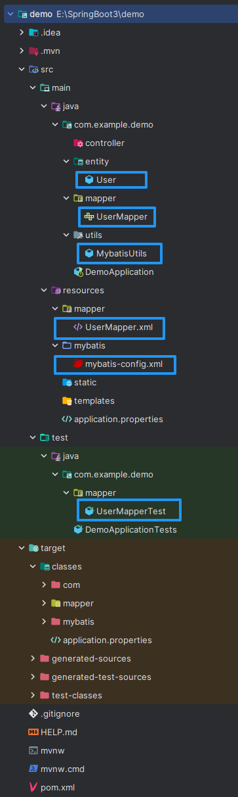

# 10. 简单的增删改查示例

1. 实体类 User.java

```java
package com.example.demo.entity;
import lombok.AllArgsConstructor;
import lombok.Data;
import lombok.NoArgsConstructor;

@Data
@NoArgsConstructor
@AllArgsConstructor
public class User {
    private String name;
    private Integer age;
    private Integer sex;
}
```

2. 实体接口 UserMapper.java

```java
package com.example.demo.mapper;

import com.example.demo.entity.User;

import java.util.List;

public interface UserMapper {
    List<User> getAllUser();
    User getUserByName(String name);
    int addUser(User user);
    int updateUser(User user);
    int deleteUser(User user);
}
```

3. 实体接口映射配置 UserMapper.xml

```xml
<?xml version="1.0" encoding="UTF-8" ?>
<!DOCTYPE mapper
        PUBLIC "-//mybatis.org//DTD Mapper 3.0//EN"
        "https://mybatis.org/dtd/mybatis-3-mapper.dtd">
<mapper namespace="com.example.demo.mapper.UserMapper">
    <select id="getAllUser" resultType="com.example.demo.entity.User">
        select * from user;
    </select>
    <select id="getUserByName" resultType="com.example.demo.entity.User" parameterType="String">
        select * from user where name = #{name};
    </select>
    <insert id="addUser" parameterType="com.example.demo.entity.User">
        insert into user (name, age, sex) values (#{name}, #{age}, #{sex});
    </insert>
    <update id="updateUser" parameterType="com.example.demo.entity.User">
        update user set age=#{age}, sex=#{sex} where name=#{name};
    </update>
    <delete id="deleteUser" parameterType="com.example.demo.entity.User">
        delete from user where name=#{name};
    </delete>
</mapper>
```

4. 测试实体接口 UserMapperTest.java

```java
package com.example.demo.mapper;

import com.example.demo.entity.User;
import com.example.demo.utils.MybatisUtils;
import org.apache.ibatis.session.SqlSession;
import org.junit.jupiter.api.Test;
import org.springframework.boot.test.context.SpringBootTest;

@SpringBootTest
public class UserMapperTest {
    SqlSession sqlSession;
    UserMapper userMapper;
    @Test
    void getAllUser() {
        sqlSession = MybatisUtils.getSqlSession();
        userMapper = sqlSession.getMapper(UserMapper.class);

        var ls = userMapper.getAllUser();
        for (var s : ls) System.out.println(s);

        sqlSession.close();
    }

    @Test
    void getUserByName() {
        sqlSession = MybatisUtils.getSqlSession();
        userMapper = sqlSession.getMapper(UserMapper.class);

        var s = userMapper.getUserByName("御坂美琴");
        System.out.println(s);

        sqlSession.close();
    }

    @Test
    void addUser() {
        sqlSession = MybatisUtils.getSqlSession();
        userMapper = sqlSession.getMapper(UserMapper.class);

        userMapper.addUser(new User("小豆梓", 17, 0));

        var ls = userMapper.getAllUser();
        for (var s : ls) System.out.println(s);

        sqlSession.commit();
        sqlSession.close();
    }

    @Test
    void updateUser() {
        sqlSession = MybatisUtils.getSqlSession();
        userMapper = sqlSession.getMapper(UserMapper.class);

        userMapper.updateUser(new User("洛琪希", 54, 0));

        var ls = userMapper.getAllUser();
        for (var s : ls) System.out.println(s);

        sqlSession.commit();
        sqlSession.close();
    }

    @Test
    void deleteUser() {
        sqlSession = MybatisUtils.getSqlSession();
        userMapper = sqlSession.getMapper(UserMapper.class);

        userMapper.deleteUser(new User("饼藏", 15, 1));

        var ls = userMapper.getAllUser();
        for (var s : ls) System.out.println(s);

        sqlSession.commit();
        sqlSession.close();
    }
}
```

## 目录结构

  
