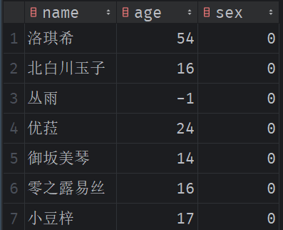

# 15. 结果集映射 resualtMap

解决问题：实体类的字段与表列名不匹配时

例如：

实体类：

```java
@Data
@NoArgsConstructor
@AllArgsConstructor
public class Wife {
    private String wife;
    private int age;
    private int sex;
}
```

表结构：

  

## resualtMap 结果集映射

### WifeMapper.java

```java
package com.example.demo.mapper;

import com.example.demo.entity.User;
import com.example.demo.entity.Wife;

import java.util.List;
import java.util.Map;

public interface WifeMapper {
    List<Wife> getAllWife();
}
```

### WifeMapper.xml

```xml
<?xml version="1.0" encoding="UTF-8" ?>
<!DOCTYPE mapper
        PUBLIC "-//mybatis.org//DTD Mapper 3.0//EN"
        "https://mybatis.org/dtd/mybatis-3-mapper.dtd">
<mapper namespace="com.example.demo.mapper.WifeMapper">
    <!-- 定义一个 WifeMap 映射类型，将表中的列与实体类的字段相对应 -->
    <resultMap id="WifeMap" type="Wife">
        <result column="name" property="wife"/>
        <!-- <result column="age" property="age"/>
        <result column="sex" property="sex"/> -->
    </resultMap>
    <select id="getAllWife" resultMap="WifeMap">
        select * from user;
    </select>
</mapper>
```