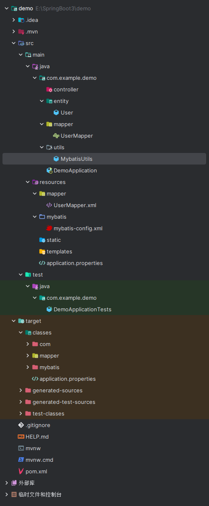

# 3. mybatis 工具类获取 SqlSession 对象

```java
package com.example.demo.utils;

import org.apache.ibatis.io.Resources;
import org.apache.ibatis.session.SqlSession;
import org.apache.ibatis.session.SqlSessionFactory;
import org.apache.ibatis.session.SqlSessionFactoryBuilder;

import java.io.IOException;
import java.io.InputStream;

public class MybatisUtils {
    private static final SqlSessionFactory sqlSessionFactory;
    static {
        String resource = "mybatis/mybatis-config.xml";
        InputStream inputStream = null;
        try {
            inputStream = Resources.getResourceAsStream(resource);
        } catch (IOException e) {
            throw new RuntimeException(e);
        }
        sqlSessionFactory = new SqlSessionFactoryBuilder().build(inputStream);
    }
    public static SqlSession getSqlSession() {
        return sqlSessionFactory.openSession();
    }
}

```  


获取到 SqlSession 后就可以执行数据库操作了

  
