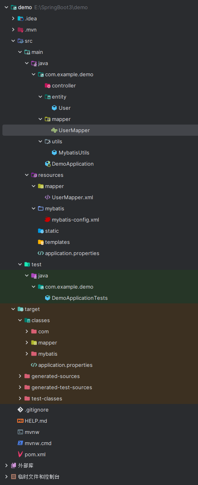

# 5. 编写 mapper 接口获取数据库数据

```java
package com.example.demo.mapper;

import com.example.demo.entity.User;

import java.util.List;

public interface UserMapper {
    List<User> getAllUser();
}
```

  


