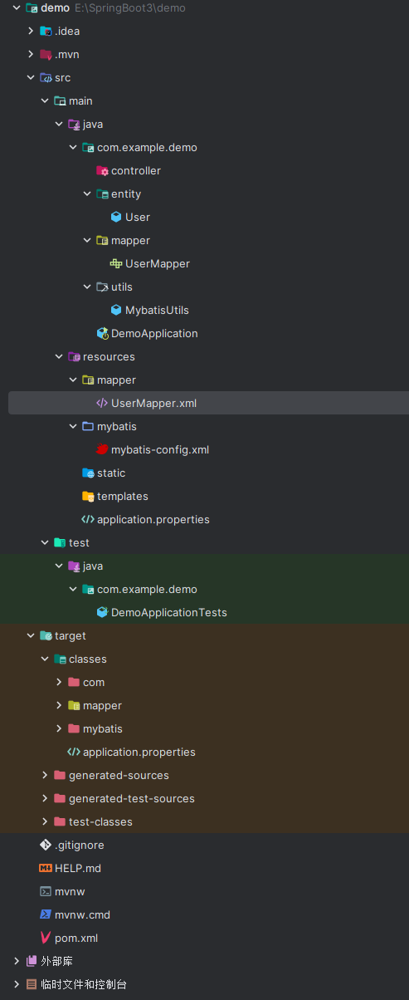

# 6. 编写 mapper 映射文件

与 `UserMapper.java` 接口相互映射，相互绑定

```xml
<?xml version="1.0" encoding="UTF-8" ?>
<!DOCTYPE mapper
        PUBLIC "-//mybatis.org//DTD Mapper 3.0//EN"
        "https://mybatis.org/dtd/mybatis-3-mapper.dtd">
<mapper namespace="com.example.demo.mapper.UserMapper">
    <select id="getAllUser" resultSets="com.example.demo.entity.User">
        select * from user;
    </select>
</mapper>
```

  


