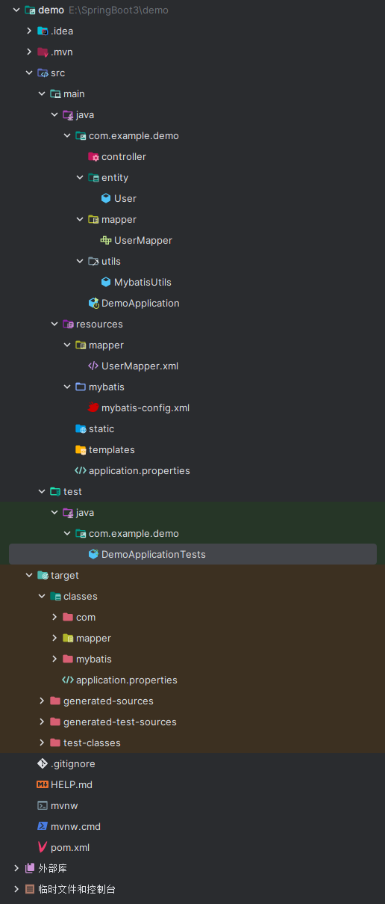

# 7. 编写测试代码，测试数据库是否连接成功

```java
package com.example.demo;

import com.example.demo.mapper.UserMapper;
import com.example.demo.utils.MybatisUtils;
import org.apache.ibatis.session.SqlSession;
import org.junit.jupiter.api.Test;
import org.springframework.boot.test.context.SpringBootTest;

@SpringBootTest
class DemoApplicationTests {

    @Test
    void contextLoads() {
        SqlSession sqlSession = MybatisUtils.getSqlSession();
        UserMapper userMapper = sqlSession.getMapper(UserMapper.class);

        var ls = userMapper.getAllUser();
        for (var s : ls) System.out.println(s);
    }

}

```

  


