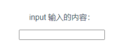

# 10. 获取 input 的输入

使用 `v-model="?"`，可以将 input 的输入绑定给『问号』

```html
<template>
  <p>input 输入的内容：{{ val }} </p>
  <input v-model="val">
</template>

<script setup>
import {ref} from "vue";
let val = ref();
</script>
```

  
