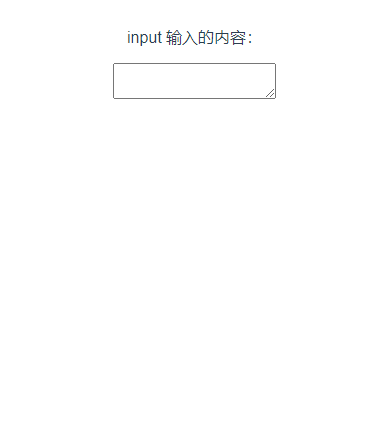

# 11. 获取 textarea 的多行文本输入

使用 `v-model="?"` 可以将 textarea 的输入绑定到『问号』中：

```html
<template>
  <p style="white-space: pre-line;">input 输入的内容：{{ val }} </p>
  <textarea v-model="val"></textarea>
</template>

<script setup>
import {ref} from "vue";
let val = ref();
</script>
```

  
