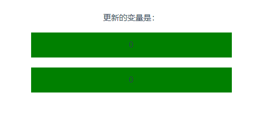
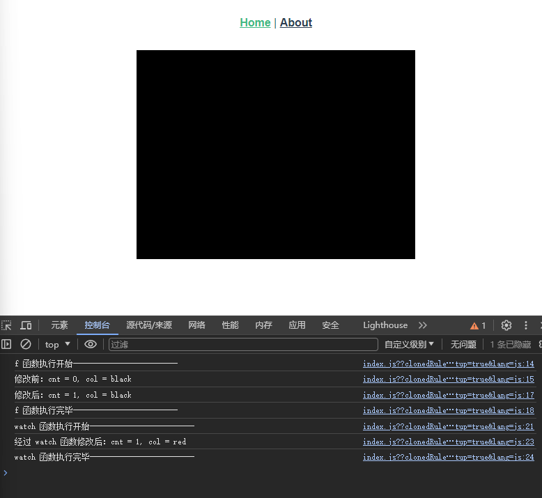

# 15. 侦听器 watch，当侦听的响应式变量发生变化时触发

## 格式：

```js
watch(
    val,
    (newVal, OldVal) => {
        do...
    },
    {
      immediate: true,  // 初始时就立马执行一次
      once: true,       // 一次性监听
      option...
    }
);
```

## 示例：

监听普通变量失败，但是监听响应式变量成功

```html
<template>
  <p>更新的变量是：{{ info }}</p>
  <div @click="x ++">{{ x }}</div>
  <div @click="y ++">{{ y }}</div>
</template>

<script setup>
import {ref, watch} from "vue";
let info = ref();
let x = 0;
let y = ref(0);
// 监听失败，因为 x 是普通变量
watch(x, (newX, OldX) => {
  info.value = "x, 旧值为：" + OldX + ", 新值为：" + newX;
});
// 监听成功，因为 y 是响应式变量
watch(y, (newY, OldY) => {
  info.value = "y, 旧值为：" + OldY + ", 新值为：" + newY;
});
</script>

<!-- Add "scoped" attribute to limit CSS to this component only -->
<style scoped>
div {
  background-color: green;
  margin: 20px auto;
  width: 400px;
  height: 50px;
  line-height: 50px;
}
</style>

```

  

### 监听响应式对象的属性变化：

假设有如下响应式对象：

```js
let val = reactive({
  cnt: 0,
  info: 'hello world'
});
```

监听属性 `val.cnt` 变化：

```js
watch(() => val.cnt, (newCnt, oldCnt) => {
  info = `oldVal = ${oldCnt}, newVal = ${newCnt}`
});
```

---

```html
<template>
  <p>info: {{ info }}</p>
  <div @click="val.cnt ++">val.cnt 的值为：{{ val.cnt }}</div>
</template>

<script setup>
import {reactive, ref, watch} from "vue";
let info = ref();
let val = reactive({
  cnt: 0,
  info: 'hello world'
});
watch(() => val.cnt, (newCnt, oldCnt) => {
  info = `oldVal = ${oldCnt}, newVal = ${newCnt}`
});
</script>

<!-- Add "scoped" attribute to limit CSS to this component only -->
<style scoped>
div {
  background-color: green;
  margin: 20px auto;
  width: 400px;
  height: 50px;
  line-height: 50px;
}
</style>
```

  

## 停止侦听器 watch

```js
let cnt = ref(0);
const unwatch = watch(cnt, (newValue) => {
  console.log(newValue);
});
setTimeout(unwatch, 5000); // 5s 后终止侦听器
```

举例：

```html
<template>
  <p>info: {{ info }}</p>
  <div @click="val ++">val 的值为：{{ val }}</div>
</template>

<script setup>
import {ref, watch} from "vue";
let info = ref();
let val = ref(0);
const unwatch = watch(val, (newValue, oldValue) => {
  info.value = `oldCnt = ${oldValue}, newCnt = ${newValue}`;
});
setTimeout(unwatch, 5000);
</script>

<!-- Add "scoped" attribute to limit CSS to this component only -->
<style scoped>
div {
  background-color: green;
  margin: 20px auto;
  width: 400px;
  height: 50px;
  line-height: 50px;
}
</style>
```

5秒后，结束侦听器

  

## 注意！！！

`watch` 函数所侦听的对象发生改变时，并不会立即就调用 `watch` 函数！

只有当 `watch` 所侦听的对象所在的块执行完毕之后，才会调用 `watch` 函数

证明如下：

```html
<script setup>
import {ref, watch} from "vue";
let colors = ['black', 'red', 'green', 'yellow'];
let cnt = ref(0);
let col = ref('black');
let f = () => {
  console.log('f 函数执行开始-------------------------')
  console.log('修改前：cnt = ' + cnt.value + ", col = " + col.value);
  cnt.value ++;
  console.log('修改后：cnt = ' + cnt.value + ", col = " + col.value);
  console.log('f 函数执行完毕-------------------------')
}
watch(cnt, () => {
  console.log('watch 函数执行开始-------------------------')
  col.value = colors[cnt.value % colors.length];
  console.log('经过 watch 函数修改后：cnt = ' + cnt.value + ", col = " + col.value);
  console.log('watch 函数执行完毕-------------------------')
})
</script>

<template>
  <div class="box" @click="f">
  </div>
</template>

<!-- Add "scoped" attribute to limit CSS to this component only -->
<style scoped lang="less">
.box {
  width: 400px;
  height: 300px;
  background-color: black;
  margin: auto;
}
</style>
```

  

`watch` 侦听的对象：`cnt` 发生改变后，等到它所在的块：`f()` 函数执行完毕后，才会调用 `watch` 回调！！