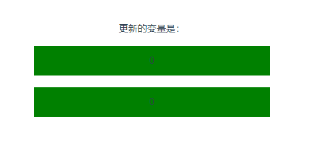

# 16. 变量和响应式变量的区别

普通变量，vue 不会跟踪普通变量的变化，只有在某些契机的情况下，才会在 页面中 刷新普通变量的值

响应式变量，vue 会跟踪响应式变量的变化，并立马在 页面中 刷新响应式变量的值

```html
<template>
  <p>更新的变量是：{{ info }}</p>
  <div @click="x ++">{{ x }}</div>
  <div @click="y ++">{{ y }}</div>
</template>

<script setup>
import {ref} from "vue";
let info = ref();
let x = 0;
let y = ref(0);
</script>

<!-- Add "scoped" attribute to limit CSS to this component only -->
<style scoped>
div {
  background-color: green;
  margin: 20px auto;
  width: 400px;
  height: 50px;
  line-height: 50px;
}
</style>

```

  
