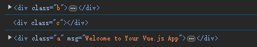

# 17. dom 对象的便捷绑定方式

```html
<template>
  <div class="a">
    <div class="b" ref="domB">
      <div class="c">

      </div>
    </div>
  </div>
</template>

<script setup>
import {onMounted, ref} from "vue";

let domB = ref();
onMounted(() => {
  console.log(domB.value);  // 成功获取到 div.b 的 dom 对象
  console.log(domB.value.querySelector("div"));  // 成功获取到 div.c 的 dom 对象
  console.log(domB.value.parentNode);  // 成功获取到 div.a 的 dom 对象
});
</script>

<!-- Add "scoped" attribute to limit CSS to this component only -->
<style scoped>

</style>
```

  
