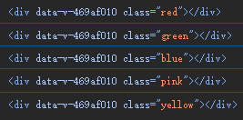

# 17. dom 对象的便捷绑定方式

## 常规绑定 dom 对象

```html
<template>
  <div class="a">
    <div class="b" ref="domB">
      <div class="c">

      </div>
    </div>
  </div>
</template>

<script setup>
import {onMounted, ref} from "vue";

let domB = ref();
onMounted(() => { // dom 在初始化后调用
  console.log(domB.value);  // 成功获取到 div.b 的 dom 对象
  console.log(domB.value.querySelector("div"));  // 成功获取到 div.c 的 dom 对象
  console.log(domB.value.parentNode);  // 成功获取到 div.a 的 dom 对象
});
</script>

<!-- Add "scoped" attribute to limit CSS to this component only -->
<style scoped>

</style>
```

  

## v-for 渲染的多个 dom 元素

给 ref 传递数组，就可以自动装载 v-for 渲染的多个 dom 对象：

```html
<template>
  <div 
  :class="x" 
  v-for="x in boxs" 
  v-bind:key="x" 
  ref="boxsList"></div>
</template>

<script setup>
import {onMounted, ref} from "vue";
let boxs = ['red', 'green', 'blue', 'pink', 'yellow'];
let boxsList = ref([]);
onMounted(() => {
  for (let i = 0; i < boxsList.value.length; i ++) {
    console.log(boxsList.value[i]);
  }
});
</script>

<!-- Add "scoped" attribute to limit CSS to this component only -->
<style scoped>
div {
  margin: auto;
  width: 400px;
  height: 300px;
}
.red { background-color: red; }
.green { background-color: green; }
.blue { background-color: blue; }
.pink { background-color: pink; }
.yellow { background-color: yellow; }
</style>
```

  

