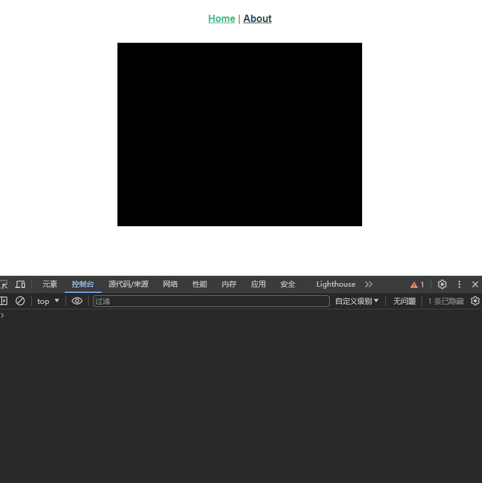

# 19. 子组件通过 emits 向父组件传递信息

## 案例 1：

实现一个子组件，该子组件点击一次就可以改变一次颜色，并且将当前是什么颜色传递给父组件

1. 先像 props 那样实现 emits 接口，这样父组件就可以直接通过 `@事件名="方法名"` 绑定某自定义事件
2. 什么时候会触发自定义事件？子组件可以规定为点击时触发、键盘按下时触发、鼠标点击时触发，变量的值发生改变时触发
3. 可以自己实现一个方法，触发该事件时，先执行该方法，然后通过 emits 抛出

```js
let emits = defineEmits(['nextColor']);
let changeColor = () => {
  // 事件触发时，调用该函数，并且该函数会抛出一些信息
  cnt ++;
  let col = colors[cnt % colors.length];
  boxDom.value.style.backgroundColor = col;
  // 通过 emits 抛出
  if (col === 'black') emits('nextColor', '黑色');
  else if (col === 'red') emits('nextColor', '红色');
  else if (col === 'green') emits('nextColor', '绿色');
  else if (col === 'yellow') emits('nextColor', '黄色');
}
```

<details open><summary>子组件代码</summary>

```html
<script setup>
import {ref} from "vue";

let colors = ['black', 'red', 'green', 'yellow'];
let cnt = 0;
let boxDom = ref();
// eslint-disable-next-line no-undef
let emits = defineEmits(['nextColor']);
let changeColor = () => {
  cnt ++;
  let col = colors[cnt % colors.length];
  boxDom.value.style.backgroundColor = col;
  if (col === 'black') emits('nextColor', '黑色');
  else if (col === 'red') emits('nextColor', '红色');
  else if (col === 'green') emits('nextColor', '绿色');
  else if (col === 'yellow') emits('nextColor', '黄色');
}
</script>

<template>
  <div class="box" ref="boxDom" @click="changeColor">

  </div>
</template>

<!-- Add "scoped" attribute to limit CSS to this component only -->
<style scoped lang="less">
.box {
  width: 400px;
  height: 300px;
  background-color: black;
  margin: auto;
}
</style>
```

</details>

<details open><summary>父组件代码</summary>

```html
<script setup>
import BoxComponent from "@/components/BoxComponent.vue";
</script>

<template>
<div>
  <box-component @next-color="(colName) => { console.log('现在的颜色是：' + colName) }"/>
</div>
</template>

<!-- Add "scoped" attribute to limit CSS to this component only -->
<style scoped lang="less">

</style>
```

</details>

  
