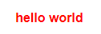

# 2. 插入 html

对标签使用属性 `v-html="?"` 插入 html：

```html
<template>
  <span v-html="val"></span>
</template>

<script setup>
let val = '<strong style="color: red">hello world</strong>';
</script>
```

  