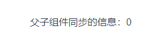
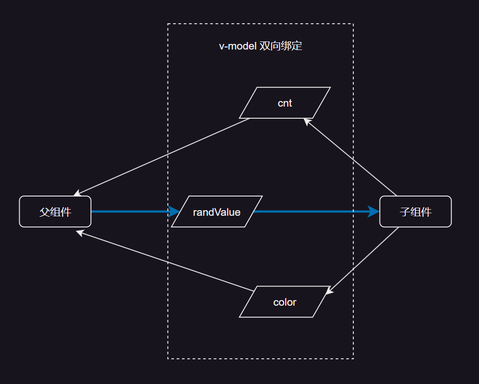
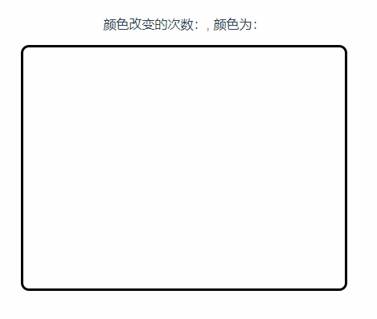

# 19. 子组件提供 v-model 接收或者传递信息给父组件 同步父子组件的值

<u>**v-model: 双向绑定**</u>

v-model 可以同步父子组件信息，属于消息传递的一种功能

基本示例：

<details open><summary>Child.vue</summary>

```html
<!-- Child.vue -->
<script setup>
// 提供一个 v-model 作为向父组件传递信息的接口
const model = defineModel(); 
model.value = 1;
</script>
```

</details>


<details open><summary>Parent.vue</summary>

```html
<!-- 父组件使用 count 接收子组件传递过来的信息 -->
<Child v-model="count" />
```

</details>

## 案例一：

<u>**子传父**</u>

子组件通过 v-model 向父组件传递信息，实现一个定时器：每过一秒递增一次数字：

<details open><summary>Child.vue</summary>

```html
<script setup>
// eslint-disable-next-line no-undef
let model = defineModel();
model.value = -114514;
setInterval(() => {
  model.value++;
}, 1000);
</script>

<template>
  <div></div>
</template>

<!-- Add "scoped" attribute to limit CSS to this component only -->
<style scoped>

</style>
```

</details>

<details open><summary>Parent.vue</summary>

```html
<script setup>
import ChildComponent from "@/components/ChildComponent.vue";
import {ref} from "vue";

let msg = ref();
</script>

<template>
  <ChildComponent v-model="msg"/>
  <div>子组件传达的信息为：{{ msg }}</div>
</template>

<!-- Add "scoped" attribute to limit CSS to this component only -->
<style scoped>

</style>
```

</details>

  


## 案例二：

<u>**父传子**</u>

子组件提供 v-model 接收父组件传递过来的信息，实现计数器的效果：

<details open><summary>Child.vue</summary>

```html
<script setup>
// eslint-disable-next-line no-undef
let model = defineModel();
// model.value = -114514;
// setInterval(() => {
//   model.value++;
// }, 1000);
</script>

<template>
  <div>父子组件同步的信息：{{ model }}</div>
</template>

<!-- Add "scoped" attribute to limit CSS to this component only -->
<style scoped>

</style>
```

</details>

<details open><summary>Parent.vue</summary>

```html
<script setup>
import ChildComponent from "@/components/ChildComponent.vue";
import {ref} from "vue";

let msg = ref(0);
setInterval(() => msg.value++, 1000);
</script>

<template>
  <ChildComponent v-model="msg"/>
</template>

<!-- Add "scoped" attribute to limit CSS to this component only -->
<style scoped>

</style>
```

</details>

  


## 案例三：带多种选项的 v-model

父组件提供一个 `0 ~ 9` 的随机值，子组件根据提供的值改变背景颜色，并向父节点传达当前的颜色、颜色改变的次数：

  


<details open><summary>ChildComponent.vue</summary>

```html
<script setup>
import {ref, watch} from "vue";

let cols = [
  'red', 'green', 'yellow', 'pink', 'blue',
  '#330000', '#003300', '#000033', '#FF0066', '#66FFFF'
];
let divDom = ref();

// eslint-disable-next-line no-undef
let color = defineModel('color'); // 需要改变的颜色

// eslint-disable-next-line no-undef
let randValue = defineModel('randInt'); // 父子组件共享的随机值

// eslint-disable-next-line no-undef
let cnt = defineModel('cnt'); // 颜色改变的次数

// eslint-disable-next-line no-undef
let colNum = defineModel('colNum');
colNum.value = cols.length;

watch(
    randValue,
    (newValue) => {
      if (!divDom.value) return;

      color.value = cols[newValue];

      // 打印这句话，你会发现 color.value 仍然保留旧值，
      // 所以需要下方的 watch 侦听函数异步侦听 color.value 
      // 当 color.value 发生改变时才执行代码
      console.log(color.value + ' vs ' + cols[newValue]);

      watch(
        color, 
        () => {
        divDom.value.style.backgroundColor = color.value;
        if (cnt.value)
          cnt.value++;
        else cnt.value = 1;
        }, 
        {once: true}
      );
    },
    {
      immediate: true,
      flush: "post"
    }
)
</script>

<template>
  <div ref="divDom"></div>
</template>

<!-- Add "scoped" attribute to limit CSS to this component only -->
<style scoped>
div {
  width: 400px;
  height: 300px;
  margin: auto;
  border: 3px solid black;
  border-radius: 10px;
}
</style>
```

</details>

<details open><summary>ParentComponent.vue</summary>

```html
<script setup>
import ChildComponent from "@/components/ChildComponent.vue";
import {ref} from "vue";

let randInt = (n) => {
  let ans = parseInt(Math.random() * n + '');
  while (ans === n) ans = parseInt(Math.random() * n + '');
  return ans;
}

let colNum = ref();
let randValue = ref(randInt(colNum.value));
let color = ref();
let cnt = ref();

// 定时传递信息给子组件
setInterval(() => {
  let ans = randInt(colNum.value);
  while (ans === randValue.value) ans = randInt(colNum.value);
  randValue.value = ans;
}, 1000);
</script>

<template>
  <p>颜色改变的次数：{{ cnt }}, 颜色为：{{ color }}</p>
  <!-- 子组件接收到 randValue 发生改变时，改变 color 和 cnt 的值 -->
  <ChildComponent v-model:color="color" v-model:rand-int="randValue" v-model:cnt="cnt" v-model:col-num="colNum"/>
</template>

<!-- Add "scoped" attribute to limit CSS to this component only -->
<style scoped>

</style>
```

</details>

  

