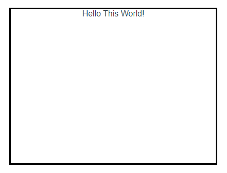

# 20.插槽

插槽方式一：

  

插槽方式二：

  


基础样例：

<details open><summary>ChildComponent.vue</summary>

```html
<template>
  <div>
    <slot></slot>
  </div>
</template>

<!-- Add "scoped" attribute to limit CSS to this component only -->
<style scoped>
div {
  margin: auto;
  border: 3px solid black;
  height: 300px;
  width: 400px;
  text-align: center;
}
</style>
```

</details>

<details open><summary>ParentComponent.vue</summary>

```html
<script setup>
import ChildComponent from "@/components/ChildComponent.vue";
</script>

<template>
  <ChildComponent>
    Hello This World!
  </ChildComponent>
</template>
```

</details>

  

## 带 id 的插槽

