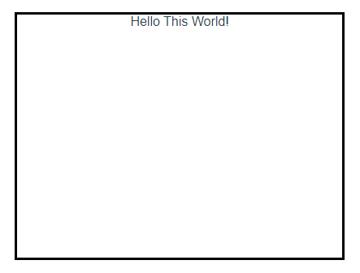

# 20.插槽

插槽方式一：

  

插槽方式二：

  


基础样例：

<details open><summary>ChildComponent.vue</summary>

```html
<template>
  <div>
    <slot></slot>
  </div>
</template>

<!-- Add "scoped" attribute to limit CSS to this component only -->
<style scoped>
div {
  margin: auto;
  border: 3px solid black;
  height: 300px;
  width: 400px;
  text-align: center;
}
</style>
```

</details>

<details open><summary>ParentComponent.vue</summary>

```html
<script setup>
import ChildComponent from "@/components/ChildComponent.vue";
</script>

<template>
  <ChildComponent>
    Hello This World!
  </ChildComponent>
</template>
```

</details>

  

## 带名字的插槽

实现一个可折叠的笔记框子组件，可折叠笔记框包含两个部分：一个是标题，一个是内容

<details open><summary>ChildComponent.vue</summary>

```html
<script setup>

// eslint-disable-next-line no-undef
import {ref, watchEffect} from "vue";

// eslint-disable-next-line no-undef
let props = defineProps(['noteWidth']);
let bodyDom = ref();
let headerDom = ref();
let contentDom = ref();

let clickCnt = ref(0);

watchEffect(() => {
  if (bodyDom.value) {
    bodyDom.value.style.width = props.noteWidth;
  }
});
</script>

<template>
<div class="body" ref="bodyDom">
  <div class="header" ref="headerDom" @click="clickCnt++">
    <slot name="header"></slot>
  </div>
  <div class="content" ref="contentDom" v-if="clickCnt % 2">
    <slot name="content"></slot>
  </div>
</div>
</template>

<!-- Add "scoped" attribute to limit CSS to this component only -->
<style scoped>
.body {
  border: 1px solid #448AFF;
  border-radius: 5px;
  font-size: 20px;
  text-align: left;
  overflow: hidden;
  opacity: 1;
}
.header {
  background-color: #ECF3FF;
  font-weight: bold;
  padding: 10px;
}
.content {
  padding: 10px;
}
</style>
```

</details>

<details open><summary>ParentComponent.vue</summary>

```html
<script setup>

import ChildComponent from "@/components/ChildComponent.vue";
</script>

<template>
<div>
  <ChildComponent note-width="400px">
    <template #header>标题</template>
    <template #content>
      <p>子组件：可折叠的笔记框，有 header标题 和 content内容 两个部分组成</p>
      <p>此样例用于介绍『具名插槽』的功能</p>
    </template>
  </ChildComponent>
</div>
</template>

<!-- Add "scoped" attribute to limit CSS to this component only -->
<style scoped>
div {
  margin: auto;
}
</style>
```

</details>