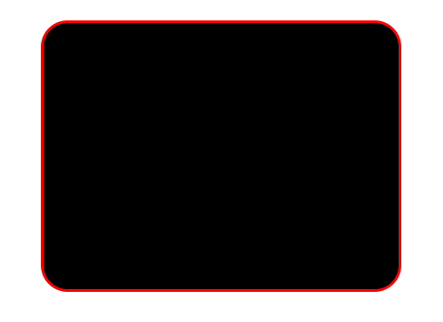

# 6. 动态增减类名

使用 `v-bind:class="?"` 可动态增减类名：

## 给 `class` 绑定对象

假设给 `class` 绑定对象：`:class={box: isBox}`，如果 `isBox = true`，则类名 `box` 有效，否则消失

通过控制键值真假，来控制类名是否显示

```html
<template>
  <div v-bind:class="val"></div>
</template>

<script setup>
import {ref} from "vue";

let val = ref({
  box: true,
  border: true,
  black: true,
  borderRadius: true
});
let f = () => {
  val.value.borderRadius = false;
};
// 5秒后，不显示边框圆角效果
setTimeout(f, 5000); 
</script>

<!-- Add "scoped" attribute to limit CSS to this component only -->
<style scoped>
.box {
  margin: auto;
  width: 400px;
  height: 300px;
}
.border {
  border: 3px red solid;
}
.black {
  background-color: black;
}
.borderRadius {
  border-radius: 30px;
}
</style>
```


  

## 给 `class` 绑定数组

```html
<template>
  <div v-bind:class="val"></div>
</template>

<script setup>
import {ref} from "vue";
let val = ref(['box', 'black', 'border', 'borderRadius']);
</script>

<!-- Add "scoped" attribute to limit CSS to this component only -->
<style scoped>
.box {
  margin: auto;
  width: 400px;
  height: 300px;
}
.border {
  border: 3px red solid;
}
.black {
  background-color: black;
}
.borderRadius {
  border-radius: 30px;
}
</style>
```
