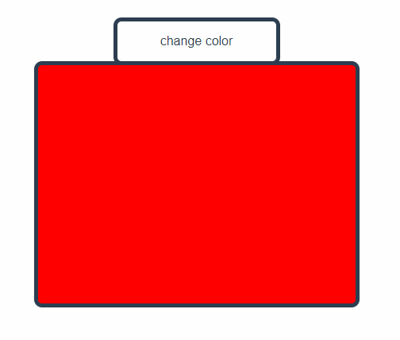

# 7. 条件为真才渲染元素

使用 `v-if`、`v-else-if`、`v-else` 可以根据条件真假来控制是否渲染元素：

```html
<template>
  <div class="click" @click="controller.cnt ++">change color</div>
  <div class="box red" v-if="(controller.cnt % 5) === 0"></div>
  <div class="box green" v-else-if="(controller.cnt % 5) === 1"></div>
  <div class="box blue" v-else-if="(controller.cnt % 5) === 2"></div>
  <div class="box pink" v-else-if="(controller.cnt % 5) === 3"></div>
  <div class="box yellow" v-else></div>
</template>

<script setup>
import {reactive} from "vue";

let controller = reactive({
  cnt: 0
});
</script>

<!-- Add "scoped" attribute to limit CSS to this component only -->
<style scoped>
.click {
  margin: auto;
  height: 50px;
  width: 200px;
  border-radius: 10px;
  border: 5px solid;
  line-height: 50px;
}
.click:hover { background-color: #42b983; }
.box {
  width: 400px;
  height: 300px;
  margin: auto;
  border-radius: 10px;
  border: 5px solid;
  margin-top: -5px;
}
.red { background-color: red; }
.green { background-color: green; }
.blue { background-color: blue; }
.pink { background-color: pink; }
.yellow { background-color: yellow; }
</style>

```

  

## v-show

`v-show` 与 `v-if` 使用及功能完全一样

不同的是：

> v-show 渲染的元素并不会从 dom 中消失，而是被“隐藏”起来了
>
> v-if 是真实地从 dom 中消失

