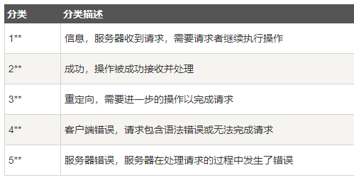

# 1. 什么是HTTP

HTTP (超文本传输协议) 是一个简单的请求-响应协议，它通常运行在 TCP 之上。

- 文本：html、字符串、···
- 超文本：图片、音乐、视频、定位、地图、···
- Http 默认端口：80
- Https 默认端口：443

  

响应体：

```yml
Accept: 告诉浏览器，它所支持的数据类型
Accept-Encoding: 告诉浏览器，支持哪种编码格式       GBK UTF-8 GB2312 ISO8859-1
Accept-Language: 告诉浏览器，它的语言环境
Cache-Control: 缓存控制
Connection: 告诉浏览器，请求完成是断开还是保持连接
HOST: 主机
Refresh: 告诉客户端，多久刷新一次
Location: 让网页重新定位
```

## Http 请求

请求方式：

- get：请求能携带的参数比较少，大小有限制，会在浏览器的URL地址栏显示数据内容，不安全，但高效
- post：请求能携带的参数无限制，大小没有限制，不会再浏览器的URL地址栏显示内容，安全

## Http 响应

200：请求成功
302：请求重定向
404：找不到资源
500：服务器错误

  
