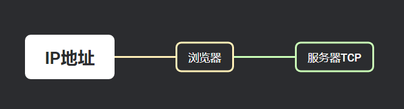

# 2. 浏览器输入地址搜索需要经过什么步骤

  

## 第一步：URL 解析和 DNS 解析

当用户在浏览器中输入 URL 后，**浏览器首先会对 URL 进行解析**；

URL 通常由多个部分组成，包括：

- 协议（例如Http、Https）
- 域名（例如：www.baidu.com）
- 端口号（http是80，https是443）
- 路径（指服务器上的文件路径）
- 查询参数（传递给服务器的参数）

  

URL -> DNS -> IP地址

  

## 第二步：建立 TCP 连接

一旦**浏览器获得了IP地址**，浏览器就会开始建立与服务器的TCP（传输控制协议）连接，浏览器会与服务器的指定端口（默认80或443）建立TCP连接，以便后续进行数据传输

  

## 第三步：发送 HTTP 请求

建立 TCP 连接后，浏览器会发送 HTTP 请求到服务器，服务器收到 HTTP 请求后，会根据请求内容进行处理，并返回相应的 HTTP 响应

  

## 第四步：接收服务器响应和页面渲染

服务器收到浏览器的 HTTP 请求后，会根据请求内容处理并生成相应的 HTTP 响应。

HTTP 响应中包含了服务器返回的资源内容，例如 HTML 文件、CSS 样式、JavaScript 脚本、图片等

浏览器接收到服务器的 HTTP 响应后，会开始解析和渲染页面

浏览器解析 HTML 文件，构建 DOM 树，同时解析 CSS 样式和 JavaScript 脚本，生成渲染树，并将其合成为最终的页面布局。

最后，浏览器会将页面内容显示在用户的浏览器窗口中，用户就可以看到并与页面进行交互了

  

